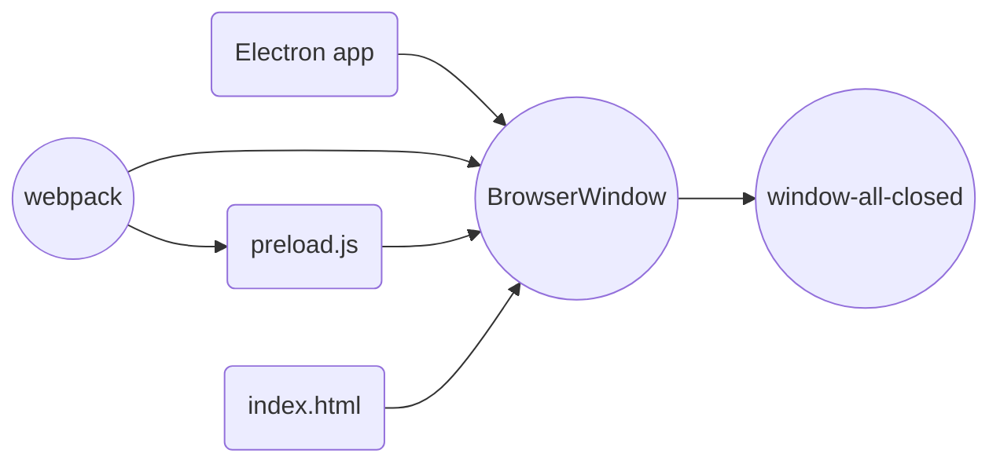

# Electron React TypeScript README

このプログラムは、Electronで作成されたWebアプリケーションです。ReactとTypeScriptを使用して開発されています。

## ディレクトリ構成

```
electron-react-typescript
├── README.md
├── package-lock.json
├── package.json
├── src
│   ├── main.ts
│   ├── preload.ts
│   └── web
│       ├── App.tsx
│       ├── index.html
│       └── index.tsx
├── tsconfig.json
└── webpack.config.ts
```

- `main.ts`：Electronのメインプロセス
- `preload.ts`：レンダラープロセスで実行されるプリロードスクリプト
- `App.tsx`：Reactコンポーネントのルート
- `index.html`：ReactがレンダリングされるHTMLファイル
- `index.tsx`：Reactのエントリーポイント
- `tsconfig.json`：TypeScriptの設定ファイル
- `webpack.config.ts`：webpackの設定ファイル

## 起動方法

以下の手順でアプリを起動してください。

1. 依存パッケージをインストールする

```
npm install
```

2. アプリを起動する

```
npm start
```

## ライセンス

MIT licneseでリリースされています。

## 設定

以下は、アプリの設定概要です。



- Electronアプリは、`BrowserWindow`インスタンスを作成します
- `BrowserWindow`の設定は、`main.ts`で設定します
- `BrowserWindow`は、`index.html`を表示します
- `index.html`は、`index.tsx`を読み込みます
- webpackにより、`preload.ts`がビルドされ、`preload.js`が生成されます
- `preload.js`は、`BrowserWindow`にプリロードスクリプトとして読み込まれます