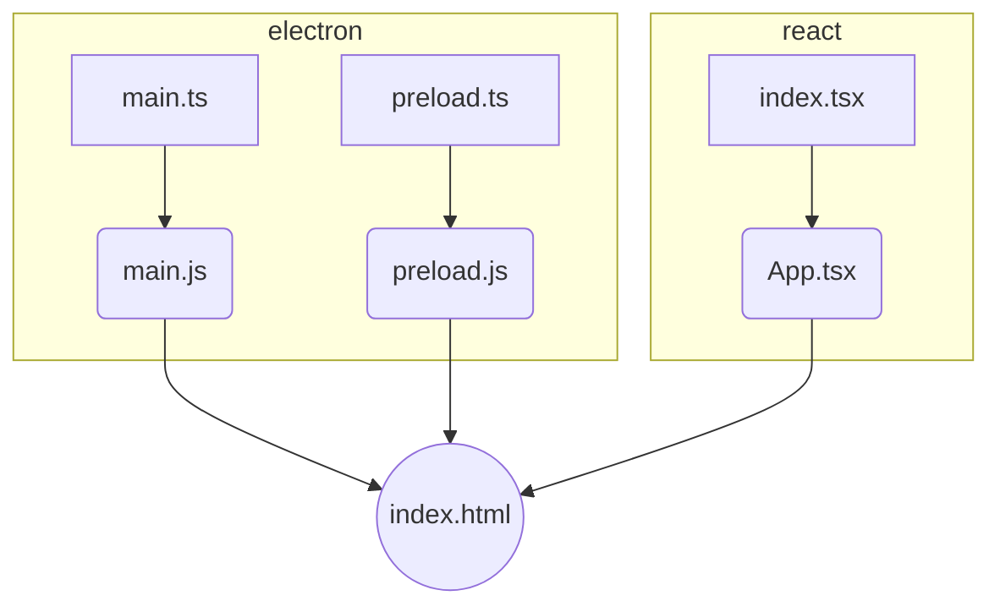

# electron-react-typescript

このリポジトリは、ElectronとReactとTypeScriptを組み合わせたアプリケーションです。

## インストール

```
npm install
```

## 実行

### 開発モード

```
npm run dev
```

### ビルド

```
npm run build
```

## ディレクトリ構成

```
electron-react-typescript/
├── README.md
├── package-lock.json
├── package.json
├── src/
│   ├── main.ts
│   ├── preload.ts
│   └── web/
│       ├── App.tsx
│       ├── index.html
│       └── index.tsx
├── tsconfig.json
└── webpack.config.ts
```

## 構成図

